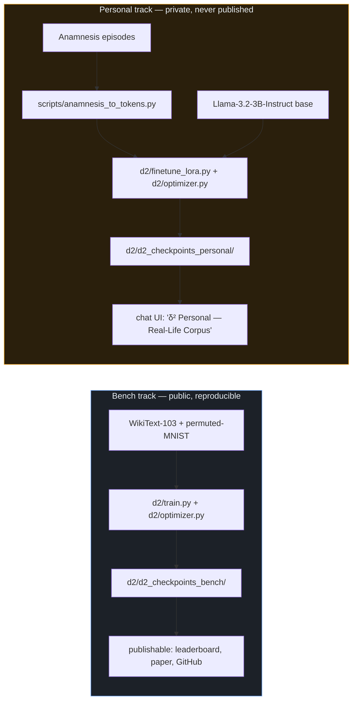

# Two tracks — bench vs personal δ²

## TL;DR

δ² ships in **two completely separate training pipelines** that share the optimizer and the engine but nothing else. The **bench** track trains from scratch on public datasets (WikiText-103, permuted-MNIST) and produces numbers we can publish and that anyone can reproduce. The **personal** track LoRA-fine-tunes a base model (Llama-3.2-3B-Instruct) on a private corpus of Anamnesis episodes — your real conversations — to produce a chat partner that talks more like you. The two never share checkpoints, datasets, or output directories. This document exists so a future contributor (or future you, three months from now) can tell at a glance which is which and why mixing them would be a mistake.

## Pipelines

## What this protects against

- **Contamination of benchmark numbers by personal data** — if an episode leaked into bench training set, BWT/ACC numbers would be uninterpretable.
- **Accidental leak of personal patterns** — bench checkpoints get pushed publicly; personal checkpoints must never be.
- **Reviewer credibility** — keeping the bench pipeline pristine and reproducible is the precondition for the paper being takable seriously.
- **Fork friendliness** — anyone can clone, run the bench track, get the published numbers. The personal track they ignore.

## How to NOT mix them

- Never change `--output-dir` between tracks. Bench writes to `d2/d2_checkpoints_bench/`, personal to `d2/d2_checkpoints_personal/`. Period.
- Personal experiment names MUST start with `personal_` — the chat resource probe (`_probe_d2_personal` in `app/routes/chat.py`) filters on this prefix; the bench probe (`_probe_d2`) excludes it.
- The dashboard δ² tab leaderboard reads ONLY from bench runs. Personal runs do not appear there and should not.
- Never ingest Anamnesis episodes into a bench training script. Tokenization for personal lives in `scripts/anamnesis_to_tokens.py` exclusively.
- When sharing logs or screenshots externally, double-check the experiment name prefix before publishing.
