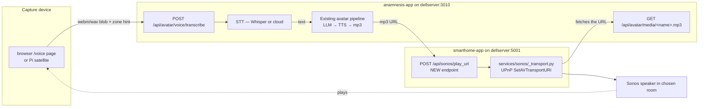

# Plan — Global Mic + Sonos Voice Interaction with Belle Avatar

**Author:** `dellserver-anamnesis:d2`
**Date:** 2026-06-19
**Status:** DRAFT — design proposal, awaiting operator decisions on §5 open questions before implementation.

---

## 1. Problem statement

Operator wants to **talk to Belle from anywhere in the house** and **hear her response on Sonos**. Today, the avatar chat lives in the browser at `/avatar` on dellserver:3010 — voice input requires sitting at a screen with a mic, and the response only plays through that browser tab. The ask is to lift voice interaction out of the browser into the physical environment.

Inputs available per operator: **Sonos device microphones + office PC USB mic + USB camera mic**. Outputs: Sonos speakers (already integrated in `0_MOBIUS.SMART_HOME`).

---

## 2. Hard constraint (READ FIRST — shapes the whole design)

> **Sonos hardware microphones are NOT third-party accessible.** Sonos's UPnP/SOAP API exposes playback control + announcement. Mic streams on Sonos hardware (Era 100/300, Beam Gen 2, Arc, Roam, etc.) are routed exclusively to Sonos's own voice services (Sonos Voice Control, Alexa, Google Assistant). There is **no documented or undocumented public API** to capture raw mic audio from a Sonos device as a third party.

The existing smarthome Sonos integration confirms this — `services/sonos/` is entirely playback (discovery, announce, queue, snapshot, transport). No mic surface, and there could not be one.

**Implication:** "Sonos mic arrays" as an input source cannot be implemented via Sonos hardware. We either accept that and use only the PC mics, OR we co-locate separate mic hardware (e.g. Raspberry Pi Zero W + USB mic) near each Sonos zone and brand it as "the kitchen Sonos mic" for UX purposes — but it's a separate device.

---

## 3. Realistic mic sources

| Source | Reach | Capture path | Latency | Cost |
|--------|-------|--------------|---------|------|
| **Office PC USB mic** | office room | PulseAudio via PipeWire (browser-side via `getUserMedia` from `/avatar` UI is easiest path) | low | $0 (exists) |
| **Office PC USB camera mic** | office room | same as above; cam mic enumerated alongside USB mic | low | $0 (exists) |
| **Phone PWA** (iOS Safari / Android Chrome) | mobile / anywhere in house with WiFi | `getUserMedia` in a small PWA served from anamnesis-app, push-to-talk button | low-medium | $0 (already have phones) |
| **Pi Zero W + USB mic** (one per Sonos zone) | per-zone, always-on | Pi runs a tiny FastAPI that streams audio to anamnesis-app on wake-word or PTT | medium (per-zone) | ~$15/zone + mic |
| **Sonos hardware mic** | — | **not possible** (see §2) | — | — |

---

## 4. Architecture



**Why this shape:**
- Anamnesis owns the LLM+TTS pipeline; smarthome owns the Sonos transport. Neither needs to learn the other's domain.
- The mp3 is **already** served by anamnesis at `/api/avatar/media/<name>.mp3` (the existing avatar pipeline produces this on every chat turn). Smarthome's Sonos transport fetches that URL via plain HTTP — same shape as how it already serves its own TTS clips at `/api/sonos/clip/<name>`.
- One new endpoint on smarthome: `POST /api/sonos/play_url body={room, url, volume?}`. Trivially small — it's the same SOAP `SetAVTransportURI` call already used by `announce`, minus the TTS rendering step.

---

## 5. Open questions (operator decisions before code)

### 5.1 STT engine — local or cloud?

| Option | Pros | Cons |
|--------|------|------|
| **Local: faster-whisper (CPU)** on dellserver | $0/call, no network, 28 cores available | base model = ~1-2s per utterance; medium ~3-5s; large too slow on CPU |
| **Local: whisper.cpp w/ small model** | even smaller footprint, can shard | accuracy tradeoff at small model size |
| **Cloud: OpenAI Whisper API** | best accuracy, low latency (~500 ms) | $0.006/min, network dependency |
| **Cloud: Together.ai Whisper** | cheaper than OpenAI, already have key in AWS | similar latency |
| **Cloud: Anthropic / Voxtral** | check availability for non-streaming speech | uncertain pricing/availability |

**Recommendation:** Phase 1 = `faster-whisper` with `medium.en` model on dellserver CPU. ~$0 marginal cost, ~3s latency, accuracy good enough for casual conversation. Cloud is the upgrade path if latency bites.

### 5.2 Trigger — wake word or push-to-talk?

- **Push-to-talk (PTT)**: explicit gesture (button in PWA / hotkey on PC / physical button on Pi). Zero false positives, no always-listening privacy issue, simpler.
- **Wake word ("Hey Belle")**: always-on local detection (Picovoice Porcupine, openWakeWord). True hands-free. Needs always-listening device per zone + a wake-word engine licence (Porcupine free for personal, paid for commercial).

**Recommendation:** Phase 1 = PTT only (browser PWA + office PC hotkey). Phase 2 = add wake word per Pi satellite if Phase 1 sticks.

### 5.3 Zone routing — which Sonos plays the response?

- **(a) Same zone as capture**: each capture device declares its zone; response plays there. Requires per-device zone config.
- **(b) Operator-chosen default zone**: a "default Belle speaker" setting in Mongo; everything plays there regardless of capture origin.
- **(c) UI-selectable per turn**: dropdown in the PWA / voice page to pick the speaker.

**Recommendation:** Phase 1 = (b) + (c) (default speaker with override). Phase 2 = (a) when per-zone capture is in.

### 5.4 Persona continuity — multi-user or just operator?

Belle currently has one global persona, one chat history per `session_id`. If Jessica or the kids might trigger via voice, do we want:
- Single shared history (all family members talk to the same Belle)?
- Voice-identified per-user history (much harder — speaker diarization)?

**Recommendation:** Operator-only this round; defer multi-user as a separate plan when/if needed.

### 5.5 PWA vs server-rendered page

For the phone-as-mic case, easiest is a tiny PWA page served by anamnesis (e.g. `/voice`) that handles `getUserMedia` + a big PTT button. Operator already has Safari / Chrome on phone with HTTPS access to dellserver via the LAN cert. Confirm acceptable, or rule out (e.g. wants a native iOS shortcut instead).

---

## 6. Smarthome integration — what to add

`smarthome-app` at `dellserver:5001`, source `~/0_MOBIUS.SMART_HOME/services/sonos/`. Existing public surface:

| Endpoint | Body | Purpose |
|----------|------|---------|
| `GET /api/sonos/speakers` | — | List speakers (ip → room) |
| `POST /api/sonos/announce` | `{room, text, volume?}` | TTS via local Coqui then play |
| `GET /api/sonos/clip/{name}` | — | Serve runtime-generated clip |

### 6.1 New endpoint: `POST /api/sonos/play_url`

```python
# In ~/0_MOBIUS.SMART_HOME/services/sonos/routes.py
@app.post("/api/sonos/play_url", include_in_schema=False)
async def sonos_play_url(request: Request):
    """Play an arbitrary HTTP URL on a Sonos room. Body: {room, url, volume?}."""
    body = await request.json()
    room = body.get("room")
    url = body.get("url")
    if not room or not url:
        return JSONResponse({"error": "room and url required"}, status_code=400)
    volume = body.get("volume")
    # Reuse the existing transport — same SetAVTransportURI SOAP call that
    # `announce` makes after rendering its TTS, without the rendering step.
    get_sonos().play_url(room, url, volume=volume)
    return JSONResponse({"played": True, "room": room, "url": url})
```

`Sonos.play_url(room, url, volume=None)` is a thin wrapper over the existing `TransportMixin.SetAVTransportURI(...)` already in `_transport.py`. If `announce` doesn't already factor this out, lift the play step into a method and call it from both places.

### 6.2 Anamnesis → smarthome client

New module in anamnesis: `app/avatar/sonos_client.py` — minimal httpx wrapper:

```python
SMARTHOME_URL = config.SMARTHOME_URL  # http://smarthome-app:5000 (intra-LAN)

async def play_url_on_sonos(room: str, url: str, volume: int | None = None) -> dict:
    async with httpx.AsyncClient(timeout=5.0) as c:
        r = await c.post(f"{SMARTHOME_URL}/api/sonos/play_url",
                         json={"room": room, "url": url, "volume": volume})
        r.raise_for_status()
        return r.json()

async def list_rooms() -> list[dict]:
    async with httpx.AsyncClient(timeout=3.0) as c:
        r = await c.get(f"{SMARTHOME_URL}/api/sonos/speakers")
        r.raise_for_status()
        return r.json().get("speakers", [])
```

Config addition: `SMARTHOME_URL` in `.env` (static, points at smarthome-app on dellserver — `http://192.168.10.20:5001` from outside container, or container-network alias if both join same docker network).

---

## 7. Phased rollout

### Phase 1 — Office PC + PWA (MVP, this round)

1. Add `app/avatar/sonos_client.py` (anamnesis side).
2. Add `POST /api/sonos/play_url` to smarthome (small lift on `Sonos.play_url`).
3. Add `app/routes/voice.py` to anamnesis:
   - `POST /api/avatar/voice/transcribe` — multipart upload of audio blob → STT → forward to existing chat pipeline → optional `room` param to play TTS on Sonos
   - `GET /api/avatar/voice/rooms` — proxy `GET /api/sonos/speakers` so PWA has one origin
4. Add `app/templates/voice.html` — small PWA: PTT button, room dropdown (populated from `/rooms`), text feedback area showing transcript + response.
5. Wire STT — `faster-whisper` Python package, `medium.en` model, lazy-loaded.

### Phase 2 — Wake word + Pi satellites

1. Choose wake-word engine (Porcupine vs openWakeWord).
2. Build `pi_satellite/` repo: tiny Python service that runs on a Pi Zero W, listens for wake word, streams captured audio to `POST /api/avatar/voice/transcribe` with its declared zone.
3. Provision one Pi per Sonos zone the operator actually uses.

### Phase 3 — Polish

- Per-zone capture → same-zone playback (5.3a).
- Per-user history (5.4).
- Belle initiates contact via push notification.

---

## 8. State storage (per canonical AWS=bootstrap / .env=intermediate / Mongo=runtime SOT)

| What | Where | Why |
|------|-------|-----|
| `SMARTHOME_URL` | `.env` (static — host doesn't move) | Bootstrap address |
| Default Sonos room for Belle response | Mongo `settings._id=voice_config` | UI-editable, changes at runtime |
| Per-device zone declarations | Mongo `voice_devices` collection | New devices register themselves |
| Voice interaction log (request text, room, latency) | Mongo `voice_log` collection | Queryable history, debugging |
| Wake-word config (sensitivity, models) | Mongo `settings._id=voice_wake` | UI-editable per-zone |

---

## 9. Risks / open infrastructure questions

- **Latency budget:** STT (~3s on CPU) + LLM (~5-15s warm) + TTS (~2-5s) + Sonos fetch latency = **10-25 seconds end-to-end** per utterance. Conversational? Tolerable for casual queries, painful for back-and-forth. Wake-word turn-taking will feel worse than browser-with-text.
- **CPU contention:** dellserver already runs 28 embedding workers + crawler + scheduler + MongoDB. Adding always-loaded Whisper-medium adds ~2 GB RAM + steady CPU during STT. Need to measure.
- **Network between anamnesis-app and smarthome-app:** both run on dellserver, but in separate containers. Either join the same docker network (clean), or use `host.docker.internal:5001` (works, less clean).
- **Sonos volume protection:** an LLM with a bug + a household member sleeping nearby = 11pm "What did you mean by that?!" at 80 dB. Cap volume server-side per BBBU-style safety constraint.

---

## 10. Operator decisions required to start Phase 1

1. **STT engine choice** — go with local `faster-whisper medium.en` as default? Or specify cloud preference?
2. **Trigger** — PTT-only for Phase 1 OK? Or want wake word from the start?
3. **Default Sonos room** — name it and I'll wire it as the Phase-1 default.
4. **PWA URL** — serve at `/voice` on anamnesis? Or a separate hostname?

Once those four are answered, Phase 1 is ~1 day of code (mostly the voice page + STT integration; the smarthome side is ~30 lines).

---

## 11. Not in scope (explicitly)

- Multi-user voice ID / per-user history
- Reverse-engineering Sonos mic access
- Voice "shortcuts" (commands that bypass the LLM — e.g. "Lights off")
- Local-LLM inference on the Pi (always remote to anamnesis)
- Background music integration (Belle doesn't take over the speaker if you're playing Sonos audio — needs snapshot/restore via `services/sonos/_snapshot.py`; defer to Phase 2)
