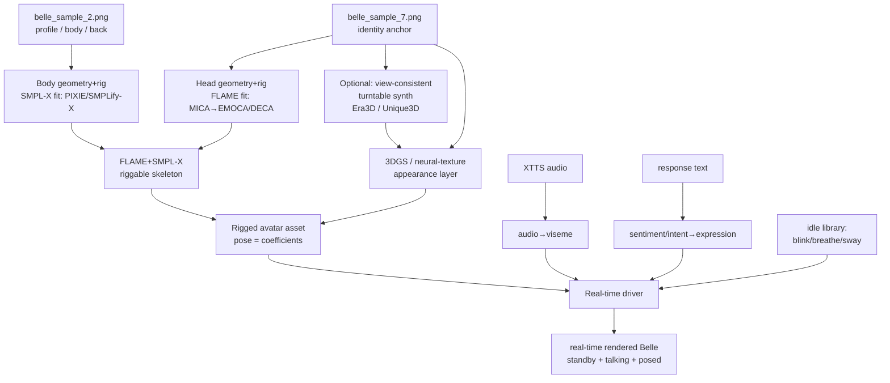

# Local, Clean-Room, 3D Riggable Belle Avatar — built from the GPT persona portraits

- **Status:** Design / not started
- **Author:** `dellserver-anamnesis:avatar` (secondary chat) — for Elfege
- **Date:** 2026-06-12
- **Untracked:** lives under `docs/` (gitignored) per RULE 19.1.3. Promote later if finalized.

---

## 0. One-line rationale

Replace the per-utterance neural render (SadTalker / MuseTalk / Hallo2 — slow, GPU-heavy each call, identity-drifting, and currently dependency-rotted) with **one persistent, owned, riggable 3D avatar of Belle** that renders in real time and is posed/animated by locally-authored coefficients. Built **clean-room from our own GPT persona portraits** — never from ParoleSonore's clip — so the character is ours.

---

## 1. Goal & non-goals

**Goal.** A persistent 3D Belle that:
- renders **real-time** (replaces 30–120 s SadTalker renders),
- has **stable identity** by construction (no per-render drift),
- is **fully poseable locally** — expression, gaze, head, and **full body** — via coefficients, with **no content policy** (no hosted model gatekeeping),
- is **decoupled** from the office-worker dep-rot (basicsr/torchvision, transformers/`isin_mps_friendly`) and from any external API,
- exposes the original want: a **standby idle loop** (blink / breathe / micro-sway) — which falls out for free.

**Non-goals (now).** Photoreal at extreme profile/occlusion; full physics cloth/hair sim; lip-sync in languages beyond fr/en; matching the ParoleSonore character exactly (explicitly *avoided* for IP).

---

## 2. Why this architecture (constraint → consequence)

| Constraint stated by operator | Consequence |
|---|---|
| Must be a real **3D model**, persistent | Rules out generative video (Sora/Kling/Runway/Veo) — they output drifting 2D pixels, not a 3D asset |
| **IP-clean** (ours, not theirs) | Build from our GPT samples; never reconstruct from ParoleSonore footage. Clip was **purged**, never studied for geometry |
| **Unrestricted** posing (incl. explicit/body) | Rules out *all* hosted APIs (NSFW + likeness filters, non-bypassable). Only a **self-hosted rig** has no gatekeeper — a coefficient is just math |
| **Real-time**, modest GPU | 3DGS rendering is cheap; FLAME/SMPL-X posing is trivial. Replaces seconds-to-minutes neural render |
| **Stable identity** | Anchor geometry once on a single canonical portrait; appearance baked into the asset |

The content/posing requirement is not a wrinkle to route around — it is the deciding vote **for** the local rig and **against** every rent-an-API path.

---

## 3. Identity source & the decisive finding

Source set: `samples/personas/Belle/belle_sample_{0..7}.png` (GPT-built from *Je suis pas accro*, intentionally divergent from the clip character).

**Finding:** the samples **drift** — `belle_sample_7` and `belle_sample_6` are *not the same face* (different proportions / eye colour; 6 reads more CG). GPT re-imagined each image, so they are **not view-consistent**. Therefore:

- ❌ Cannot naively multi-view-splat the sample set (3DGS/NeRF need a consistent object).
- ✅ Must **anchor on ONE** canonical identity, treat the rest as *appearance references / validation*, not geometry.

**Decisions:**
- **Identity anchor = `belle_sample_7.png`** (clean frontal, neutral, well-lit, high-res — the canonical "Belle").
- **`belle_sample_2.png`** is a triptych (profile / full-body-front in slip dress / back) → loose **profile + back + body** references and a **validation** set. Not geometry ground-truth.
- Remaining samples → texture/appearance hints only.

Belle's 3D self is *defined* by `sample_7` + the rig. A fresh, owned character.

---

## 4. Pipeline

### Stage detail + candidate tooling

1. **Head geometry + rig** — single-image FLAME fit.
   - `MICA` (metric identity shape from one image) → `EMOCA`/`DECA` (expression + detail). Output: riggable FLAME head (identity + expression/jaw/gaze blendshapes).
2. **Body geometry + rig** — single-image SMPL-X fit from `sample_2` full-body.
   - `PIXIE` / `PyMAF-X` / `SMPLify-X`. SMPL-X composes with FLAME at the neck → one riggable head+body. **This is the unrestricted-posing layer** (joint angles, local, no filter).
3. **Appearance (photoreal skin)** — two options, pick by fidelity/effort:
   - **A (robust):** bake textures from `sample_7` (+ refine from sample_2 angles) onto the FLAME/SMPL-X mesh. Mature, lower fidelity.
   - **B (high fidelity):** synthesize a **view-consistent Belle turntable** from `sample_7` via multiview diffusion (`Era3D` / `Unique3D` / `Wonder3D` / `SV3D`), validate against sample_2's profile/back, then train a **FLAME-rigged 3DGS head** (`GaussianAvatars` / `FlashAvatar` / `SplattingAvatar` family). Photoreal, real-time, research-y, identity-drift risk in the synth step.
   - **Recommended:** **hybrid** — FLAME/SMPL-X for control geometry + 3DGS/neural-texture for appearance.
4. **Driver (cheap inference — "which animations"):**
   - **Lip-sync:** audio→viseme (`NVIDIA Audio2Face`-class, or open audio2blendshape, or phoneme→viseme via Rhubarb). Keep **XTTS** for voice — independent; the rig only needs the audio.
   - **Idle library:** blink / breathe / micro head-sway loops = the standby face.
   - **Expression policy:** response-text sentiment/intent → pick/blend an expression clip (start rule-based; upgrade to a small classifier).
   - **Blend state machine:** idle → talk → gesture → idle, with cross-fades.

---

## 5. Phased milestones

- **M0 — Cheapest viable slice (proves the thesis):** FLAME-fit head from `sample_7` + idle + viseme rig → **real-time talking-and-idling Belle head**. Replaces the broken SadTalker path; delivers the standby face. *No body, basic texture.*
- **M1 — Photoreal head:** add the 3DGS/neural-texture appearance layer (Path B). Belle looks like the photo, real-time.
- **M2 — Body + unrestricted posing:** SMPL-X body fit, head+body compose, local pose authoring (arbitrary positions).
- **M3 — Integration:** wrap as an avatar engine; expose in d2's **animation-engine picker** alongside SadTalker/MuseTalk; route the avatar pipeline to it.

---

## 6. Integration with the existing Anamnesis avatar stack

- **Voice:** unchanged — XTTS (`belle-parolesonore.wav` clone) stays; the rig consumes the produced audio for visemes only.
- **Worker:** new `avatar_worker` engine (CUDA), slots into the same worker infra + d2's engine picker. Real-time, so no SadTalker-style fire-and-forget.
- **Decoupling:** depends on neither basicsr/torchvision (SadTalker) nor the transformers path that 500s XTTS on office. Fresh, pinned env.
- **Standby:** the frontend already has the hidden `<video>`/standby plumbing; the rig can drive a looping idle stream or pre-rendered idle clip.

---

## 7. Risks / open questions

- **Multiview synth identity drift (Path B):** the turntable model may not hold Belle's identity. Mitigate: heavy anchoring on `sample_7`, validate vs sample_2, fall back to Path A texture-bake.
- **GPU:** server's NVML driver mismatch still unresolved (gnome crashed — same root cause likely). Reconstruction/training needs a *working* CUDA box. Office is ROCm (AMD) — fine for inference, trickier for some CUDA-only repos. **Decide the build/train host.**
  - **Build pod = transient cloud GPU.** Sizing was 4090 (24 GB), but per operator (2026-06-12) **4090s are currently non-functional on RunPod** for some reason — so default to **A100 40 GB (~$1.50/hr)** for the build. Still *transient*: provision → build/train the asset → tear down. Inference then runs on a modest/local card (cost model unchanged; only the one-time build tier moves up).
- **Hair:** wet shoulder-length hair is hard for both FLAME (no hair) and 3DGS (floaters). May need a separate hair card / strand pass, or accept 3DGS hair.
- **Body fit from one composite image** (`sample_2`) is approximate — proportions, not exact.
- **Effort:** multi-week. M0 is days; M1–M3 are the long pole.

---

## 8. IP & content posture

- **Clean-room:** built only from our GPT samples; ParoleSonore clip purged and never used for geometry. Belle (our naming, our divergent face) is an owned, derived-but-transformed character.
- **Private use:** unrestricted local posing is fine for a private project. If Belle ever goes **outward-facing/public**, revisit likeness + the GPT-derivation chain.
- **No external API** → no third-party content policy, no upload of her likeness.

---

## 9. Note (genesis-adjacent)

This is a deliberate **hybrid**: a *learned* representation (the trained avatar — scale-friendly) under *compositional/symbolic* control (the clip-selection policy). It cuts against the bitter-lesson grain ("just scale one end-to-end audio→video model") because the requirements — local, persistent, real-time, identity-stable, **unrestricted** — are exactly the ones an end-to-end hosted generator cannot meet. Amortize the expensive training **once**; keep inference cheap, owned, and steerable. The *für-sich* Belle: a stable, self-identical asset you compose with, rather than re-hallucinating her from a photo every utterance.

---

## 10. References (repos to evaluate)

- Head: FLAME · MICA · EMOCA · DECA
- Body: SMPL-X · PIXIE · PyMAF-X · SMPLify-X
- Multiview synth: Era3D · Unique3D · Wonder3D · SV3D
- 3DGS avatars: GaussianAvatars · FlashAvatar · SplattingAvatar · (audio: GaussianTalker / TalkingGaussian)
- Viseme: NVIDIA Audio2Face · Rhubarb (phoneme→viseme fallback)

---

## TODO

- [ ] Decide build/train host (needs working CUDA — server NVML mismatch blocks local today). Leaning: transient **A100 40GB** RunPod pod (4090 reportedly dead on RunPod as of 2026-06-12).
- [ ] M0: MICA→EMOCA FLAME fit on `belle_sample_7`; eyeball identity fidelity
- [ ] M0: wire idle + viseme driver; real-time head in a throwaway viewer
- [ ] Decide appearance path A (texture-bake) vs B (3DGS) after seeing M0 mesh quality
- [ ] M2: SMPL-X body fit from `belle_sample_2`; head+body compose
- [ ] M3: package as avatar engine + register in d2's animation-engine picker
- [ ] (gate) revisit IP posture only if Belle goes public-facing
